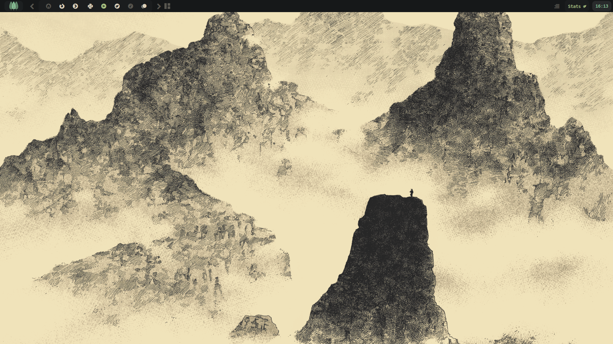
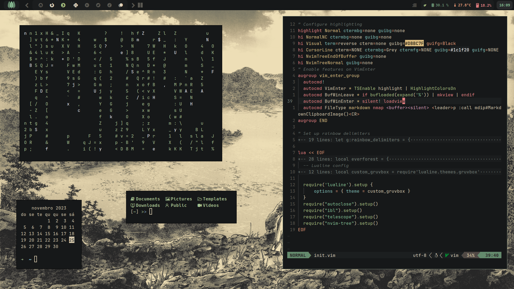
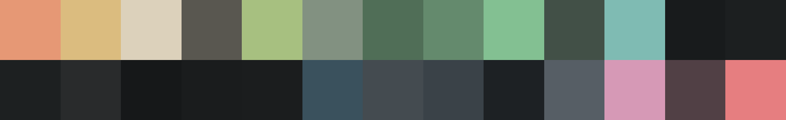

# Dotfiles
This repo is my up-to-date dotfiles of the theme I'm developing called
**Darkforest**. 

Hope you like it! I like to daily drive with mainly Arch-based
distros ([ArcoLinux](https://arcolinux.com/) at the moment)

## Darkforest




## Specifications
* **OS**: ArcoLinux
* **DE/WM**: qtile
* **Terminal**: alacritty
* **Shell**: zsh
* **Text editor(s)**: Nvim/VSCode/RStudio
* **Font**: JetBrains Mono Nerd Font, but I also use Hack NF

## Theme synthax
In order to be consistent with the color scheme, it is crucial to have a color scheme/synthax. The colors that I use are listed below and are based on both the [Everforest](https://github.com/sainnhe/everforest) and [Gruvbox](https://github.com/sainnhe/gruvbox-material) synthax.
```
- background:   '#161819'
- bg_blue:      '#3A515D'
- bg_dim:       '#181B1C'
- bg_0:         '#1A1C1D'
- bg_1:         '#1B1D1E'
- bg_2:         '#1C1F20'
- bg_3:         '#1D2021'
- bg_4:         '#292B2C'
- error:        '#514045'
- selection:    '#425047'
- light_selection: '#829181'
- fg1:          '#dcd1bb'
- orange:       '#E69875'
- red:          '#E67E80'
- yellow:       '#DBBC7F'
- green:        '#A7C080'
- aqua:         '#83C092'
- aqua1:        '#648a6d'
- aqua2:        '#506e57'
- blue:         '#7FBBB3'
- purple:       '#D699B6'
- grey:         '#595750'
- greyblock:    '#565e65'
- greyblock_dark: '#444B50'
- greybg:       '#3a4248'
- black:        '#1d2124'
```
Preview of the pallete:

